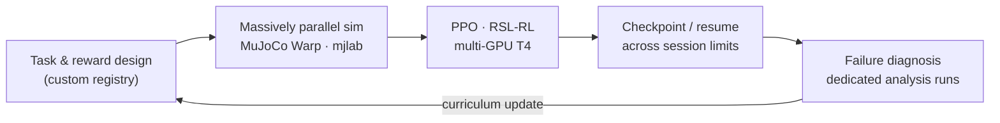
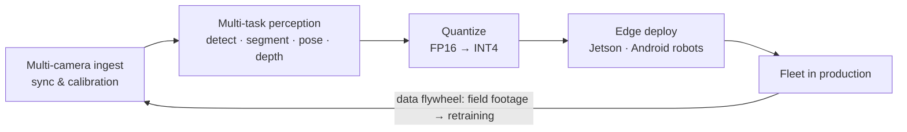

# Shivpratap Singh Panwar

### I teach humanoid robots to move and machines to see — from scratch, on hardware that actually ships.

**Computer Vision Research Engineer** · Humanoid RL · Robot Fleet Perception · Edge Inference · Medical AI

 

| 🤖 23-DoF humanoid | ⚡ INT4 on Jetson | 🎥 Multi-cam robot fleets | 📄 3 peer-reviewed | 🔬 500K+ imgs pipelined |
|:---:|:---:|:---:|:---:|:---:|
| locomotion **from scratch** | full quantization stack | perception in production | IEEE · IBM · Springer | 100+ hrs video |

---

## 🤖 Humanoid locomotion — from scratch, and still going

An ongoing program training **whole-body locomotion for the Unitree G1 (23-DoF)** with **no pretrained policy, no imitation data — reward design up**. Task registry, gait mechanics, perturbation curricula, and the training infrastructure are all custom:

- **Running that is actually running** — a speed-adaptive gait clock shortens the cycle with commanded velocity and pushes stance fraction below 0.5, opening a true **flight phase**. Stock fixed clocks make "running" an unlearnable fast walk; mine makes it a gait.
- **Take hits from any direction** — perturbation curriculum mixing instantaneous velocity impulses with **sustained horizontal drags from uniformly random headings**. The policy doesn't memorize one shove; it learns balance recovery as a skill.
- **Reverse locomotion as a first-class command** (`lin_vel_x ∈ [−1.2, 2.0]`) — walking backwards is trained, not hoped for.
- **Anti-cheat reward shaping** — standing-still and feet-air terms that stop the classic failure mode of a robot marching in place to farm gait rewards.
- **Debugging like an engineer, not a gambler** — when a policy failed backward pushes, it got its own isolation run, diagnosis, and targeted curriculum fix before retraining. Every experiment checkpointed and resumable across free-tier GPU session limits.
- Foundation-model track: [custom design work](https://github.com/shivpratapsinghpanwar/tau-0-vla_Custom_Design) on [τ0-VLA](https://github.com/sii-research/tau-0-vla) — world-model-guided test-time computation for robot control. Base stack: [my fork](https://github.com/shivpratapsinghpanwar/unitree_rl_mjlab_custom_robot) of Unitree's RL suite on [mjlab](https://github.com/mujocolab/mjlab)/MuJoCo Warp.

## 🎥 Perception for robot fleets

At **Kody Technolab** (full-stack robotics company) I build the vision layer for **multi-camera robots operating as fleets** — security, advertisement, and data-gathering platforms plus the **Mahindra Assistant**:

- Multi-task heads sharing one latency budget: detection, instance segmentation, pose and depth estimation running together on embedded compute.
- **The whole quantization ladder** — FP16 / INT8 / UINT8 / **UINT4** via TensorRT, ONNX Runtime, TFLite, OpenVINO — chosen per platform, per model, per latency budget.
- Pipelines that have processed **500K+ images and 100+ hours of robot video**; preprocessing time cut **40%**, production throughput up **~30%**.
- Model strategy per constraint: YOLO family, SAM-1/2/3, D-FINE, RF-DETR, MobileOne×ArcFace, custom architectures — the right tool for the hardware in the room, with **classical projective geometry as the fallback where deep learning runs out of data**.

## 🏥 Vision where none exists — medical robotics

Building the perception stack for a **medical robot detecting rare pediatric anomalies** — microcephaly, hydrocephaly, clubfoot, cleft lip/palate. These conditions had **no existing CV solution and almost no training data** when development started. That's the point: low-data strategies, geometry-first fallbacks, and rigorous evaluation on clinician-curated splits.

## 🏭 [Synthetic Data Factory](https://github.com/shivpratapsinghpanwar/Synthetic_Data_Factory)

When real medical data runs out, I manufacture it — and **measure whether it actually helps, not whether it looks pretty**:

- Pluggable generative backends: SD 1.5 + per-class LoRA, and a **from-scratch DDPM with zero natural-image prior** for sensitive domains.
- Every synthetic image is provenance-tracked and screened for **memorization of real patient images** before it may train anything — privacy treated as a hard gate, not a footnote.
- Honest paired multi-seed A/B on HAM10000: rare-class augmentation moved vascular-lesion F1 **+0.050 ± 0.013** and melanoma recall **+0.116 ± 0.048** ([full measured results](https://github.com/shivpratapsinghpanwar/Synthetic_Data_Factory/blob/main/docs/results.md)).
- The entire train→evaluate loop executes remotely on free Kaggle GPUs through a **git-pinned execution runner built for autonomous agent iteration** — every run reproducible to the commit.

---

## ⚡ The toolbox

| | |
|---|---|
| **Quantization** | FP16 · INT8 · UINT8 · UINT4 — TensorRT, ONNX Runtime, TFLite, OpenVINO |
| **Edge targets** | NVIDIA Jetson (Nano / Xavier / Orin) · Android robots · custom embedded boards · GPU servers |
| **Perception** | YOLO family · SAM-1/2/3 · D-FINE · RF-DETR · Faster/Mask R-CNN · pose · depth · anomaly detection |
| **Robot learning** | MuJoCo Warp · mjlab · RSL-RL (PPO) · reward & curriculum design · sim-to-real thinking |
| **Core** | PyTorch · TensorFlow · OpenCV · MediaPipe · C++ · Python · classical CV & projective geometry |

**Public lab notebook** → [Kaggle](https://www.kaggle.com/shivpratap0007): 50+ notebooks, 19 datasets — D-FINE fine-tuning with ONNX/OpenVINO export, SlowFast action recognition, MoveNet+LSTM pose pipelines, face embedding, and the G1 locomotion runs above, all reproducible.

## 📄 Publications

- **KrishiDisha: Revolutionizing Agriculture with Intelligent Recommendations using Computer Vision** — *IEEE ICoEIT, Jul 2025*. Multi-task CV platform (F1 0.99 / precision 0.96 / R² 0.98), **field-validated by 150+ farmers**.
- **Web-BCD: A Machine and Deep Learning Approach for Breast Cancer Detection** — *IBM Technical Report, Dec 2024*. 89%→94% accuracy (ROC-AUC 0.96), **deployed live for clinician use**.
- **Understanding the Patterns of Student Dropout: A Review** — *Springer, Smart Technology, Jun 2024* ([chapter](https://link.springer.com/chapter/10.1007/978-981-97-9006-7_20)).

## 💼 The short version

**ML Engineer · Kody Technolab** (Nov 2025 – present; intern Apr–Oct 2025) · **DL Research Mentee · IBM India** (2024)
**B.Tech CSE (AI/ML)** · Medi-Caps University · CGPA 8.67 · Head of Research & Astronomy, Science Club

---

*I do the boring analysis of research papers, design for compute-constrained reality, merge approaches, and ship the result.*

