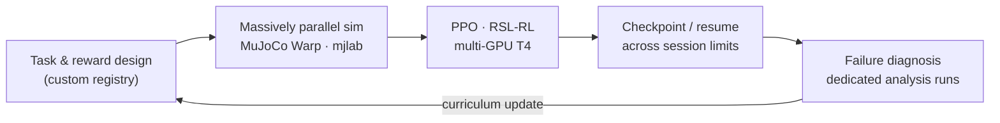
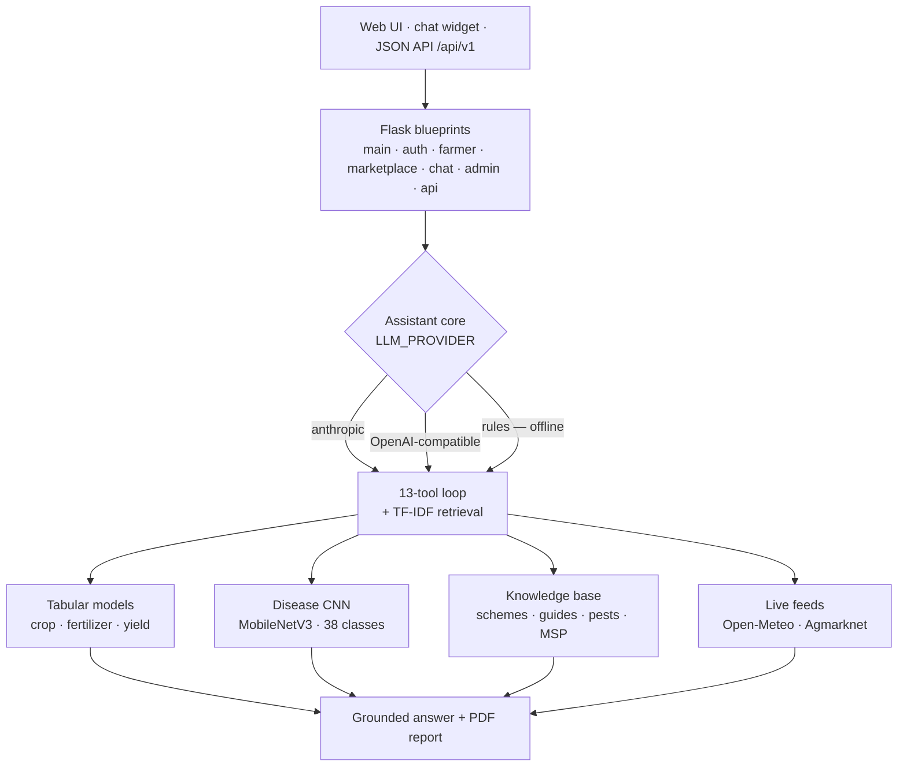

<div align="center">

# Shivpratap Singh Panwar

### I teach humanoid robots to move and machines to see — from scratch, on hardware that actually ships.

**Computer Vision Research Engineer** · Humanoid RL · Robot Fleet Perception · Edge Inference · Medical AI

[](mailto:shivpratapsinghpanwar19@gmail.com)
[](https://www.linkedin.com/in/shivpratap-singh-panwar/)
[](https://www.kaggle.com/shivpratap0007)
[](https://shivpratapsinghpanwar.github.io)

<br>

| 🌱 Field-validated | ⚡ INT4 on Jetson | 🎥 Multi-cam robot fleets | 🤖 23-DoF humanoid | 📦 Shipped on PyPI |
|:---:|:---:|:---:|:---:|:---:|
| KrishiDisha · 150+ farmers | full quantization stack | perception at fleet scale | locomotion **from scratch** | first-author IEEE · Springer |

</div>

---

## 🤖 Humanoid locomotion — from scratch, and still going

An ongoing program training **whole-body locomotion for the Unitree G1 (23-DoF)** with **no pretrained policy, no imitation data — reward design up**. Task registry, gait mechanics, perturbation curricula, and the training infrastructure are all custom:



- **Running that is actually running** — a speed-adaptive gait clock shortens the cycle with commanded velocity and pushes stance fraction below 0.5, opening a true **flight phase**. Stock fixed clocks make "running" an unlearnable fast walk; mine makes it a gait.
- **Take hits from any direction** — perturbation curriculum mixing instantaneous velocity impulses with **sustained horizontal drags from uniformly random headings**. The policy doesn't memorize one shove; it learns balance recovery as a skill.
- **Reverse locomotion as a first-class command** (`lin_vel_x ∈ [−1.2, 2.0]`) — walking backwards is trained, not hoped for.
- **Anti-cheat reward shaping** — standing-still and feet-air terms that stop the classic failure mode of a robot marching in place to farm gait rewards.
- **Debugging like an engineer, not a gambler** — when a policy failed backward pushes, it got its own isolation run, diagnosis, and targeted curriculum fix before retraining. Every experiment checkpointed and resumable across free-tier GPU session limits.
- Foundation-model track: [custom design work](https://github.com/shivpratapsinghpanwar/tau-0-vla_Custom_Design) on [τ0-VLA](https://github.com/sii-research/tau-0-vla) — world-model-guided test-time computation for robot control. Base stack: [my fork](https://github.com/shivpratapsinghpanwar/unitree_rl_mjlab_custom_robot) of Unitree's RL suite on [mjlab](https://github.com/mujocolab/mjlab)/MuJoCo Warp.

## 🎥 Day job — perception for production robots

At **Kody Technolab** I build the vision layer for multi-camera robots: multi-task perception (detection,
instance segmentation, pose and depth) quantised **FP16 → INT4** and deployed to NVIDIA Jetson, Android robots
and on-prem GPU servers, across security, advertising, assistant and data-gathering platforms — plus
perception for a **medical screening robot** targeting rare congenital conditions, a genuinely low-data problem
where classical geometry serves as the fallback.

Architecture, customers and deployment specifics stay with my employer. Everything below is work I own
outright — open source, research, or published.

## 🏭 [Synthetic Data Factory](https://github.com/shivpratapsinghpanwar/Synthetic_Data_Factory)

When real medical data runs out, I manufacture it — and **measure whether it actually helps, not whether it looks pretty**:

- Pluggable generative backends: SD 1.5 + per-class LoRA, and a **from-scratch DDPM with zero natural-image prior** for sensitive domains.
- Every synthetic image is provenance-tracked and screened for **memorization of real patient images** before it may train anything — privacy treated as a hard gate, not a footnote.
- **Paired multi-seed A/B on HAM10000** — 3 seeds, evaluated on 1,508 real images never touched by generation or model selection. Reported as measured: **macro-F1 +0.005 ± 0.019, consistent with zero.** One augmented class cleared its own spread in every seed (vascular lesion F1 **+0.050 ± 0.013**). The largest effect in the experiment was **off-target** — melanoma recall **+0.116 ± 0.048** on a class that was *never augmented* — so the writeup attributes it to class rebalancing rather than synthetic realism, and specifies the balance-matched control that would separate the two. The flattering headline was available; it is not claimed ([full measured results](https://github.com/shivpratapsinghpanwar/Synthetic_Data_Factory/blob/main/docs/results.md)).
- The entire train→evaluate loop executes remotely on free Kaggle GPUs through a **git-pinned execution runner built for autonomous agent iteration** — every run reproducible to the commit.


## 🧪 [data-doctor](https://github.com/shivpratapsinghpanwar/data-doctor) — *diagnose vision datasets before they lie to you*

```bash
pip install vision-data-doctor
```

A delivered production train/val split turned out to contain **81 groups of byte-identical images
spanning both sides**. 40% of the validation set was leaked, the reference model's 0.75 recall did
not survive an honest split, and **nothing in the training stack had warned**. This makes that a
10-second CI check instead of a post-mortem:

- **Hashes nominate; only pixels convict.** SHA-256 catches exact copies; two perceptual hash
  families over all 8 dihedral orientations nominate near-duplicates by pigeonhole bucketing; every
  candidate is then **verified on decoded pixels**, so each reported pair carries a measured
  similarity score and matching orientation (`99.4% similar, rot90`) — never a hash coincidence.
- Train/val leakage, COCO structural defects (duplicate ids, dangling references, degenerate boxes
  and polygons, zero-annotation images), corrupt files. Exit code 1 on failure — drops straight
  into CI.
- Rotated, flipped, re-encoded and resized copies all caught. Pillow is the only dependency.


## 🌾 [KrishiDisha](https://github.com/shivpratapsinghpanwar/KrishiDisha.ai) — a grounded agricultural assistant

First-author **IEEE ICoEIT 2025** ([doi:10.1109/ICoEIT63558.2025.11211713](https://doi.org/10.1109/ICoEIT63558.2025.11211713),
pp. 1028–1040), still under active development. Eight services behind one advisory surface, and an assistant
that is **never asked to know agronomy** — it is handed tools and made to cite them.



**The services:** crop recommendation (22 crops from an N-P-K and climate soil test, top-3 with probabilities
and indicative economics) · fertilizer recommendation with a kg-and-bags dose calculator and split schedule ·
leaf-photo disease detection across **38 PlantVillage classes** with prevention steps · yield prediction for
**55 crops × 30 states × 6 seasons** · weather advisories from Open-Meteo (spraying windows, frost and heat
warnings, soil moisture) · **live mandi prices** from data.gov.in's Agmarknet with an MSP fallback · **16
central government schemes** with eligibility and how to apply, 32 crop guides and a sowing calendar · a
**marketplace** of 60 farm inputs with cart, COD/UPI checkout, stock control and order tracking. Every
recommendation emits a PDF the farmer can carry to a dealer.

**Model selection was a comparison, not a single fit.** Seven classifiers (RF, Gradient Boosting, XGBoost, SVM,
kNN, Decision Tree, GaussianNB) under 5-fold CV with a fixed seed and a held-out test split — crop went to
**GaussianNB, 99.5% test accuracy** (macro-F1 0.995, CV 0.995 ± 0.004) over RF's 99.3%; fertilizer to
**XGBoost**; yield to **XGBoost at test R² 0.94** (CV 0.964 ± 0.028). Per-class reports and evaluation plots are
committed; `python -m ml.train_all` reproduces all of it.

**It degrades instead of breaking.** The `rules` provider is a complete offline intent engine that still runs
the ML models, weather and price lookups, the dose calculator, the scheme database and knowledge search — so
with no API key, no credit and no connectivity, the assistant keeps answering. For these users that matters
more than benchmark accuracy. Field-validated with **150+ farmers**; the test suite runs fully offline.

**In progress:** a small in-house language model trained on the project's own agronomy corpus, to replace the
hosted providers entirely and run the assistant on commodity hardware.

---

## ⚡ The toolbox

| | |
|---|---|
| **Quantization** | FP16 · INT8 · UINT8 · UINT4 — TensorRT, ONNX Runtime, TFLite, OpenVINO |
| **Edge targets** | NVIDIA Jetson (Nano / Xavier / Orin) · Android robots · custom embedded boards · GPU servers |
| **Perception** | YOLO family · SAM-1/2/3 · D-FINE · RF-DETR · Faster/Mask R-CNN · pose · depth · anomaly detection |
| **Robot learning** | MuJoCo Warp · mjlab · RSL-RL (PPO) · reward & curriculum design · sim-to-real thinking |
| **Core** | PyTorch · TensorFlow · OpenCV · MediaPipe · C++ · Python · classical CV & projective geometry |

**Public lab notebook** → [Kaggle](https://www.kaggle.com/shivpratap0007): 50+ notebooks, 19 datasets — D-FINE fine-tuning with ONNX/OpenVINO export, SlowFast action recognition, MoveNet+LSTM pose pipelines, face embedding, and the G1 locomotion runs above, all reproducible.

## 📄 Publications

- **KrishiDisha: Revolutionizing Agriculture with Intelligent Recommendations, Disease Detection, and Yield Prediction** — ***first author*** · *2025 IEEE International Conference on Engineering Innovations and Technologies (ICoEIT), pp. 1028–1040* · [doi:10.1109/ICoEIT63558.2025.11211713](https://doi.org/10.1109/ICoEIT63558.2025.11211713). Multi-task CV platform, **field-validated with 150+ farmers**.
- **Web-BCD: A Machine and Deep Learning Approach for Breast Cancer Detection** — *IBM Technical Report, Dec 2024*. 89%→94% accuracy (ROC-AUC 0.96), **deployed live for clinician use**.
- **A Review on Understanding the Patterns of Student Dropout** — ***first author*** · *Studies in Smart Technologies, Springer, pp. 235–250, 2025* · [doi:10.1007/978-981-97-9006-7_20](https://doi.org/10.1007/978-981-97-9006-7_20).

## 💼 The short version

**ML Engineer · Kody Technolab** (Nov 2025 – present; intern Apr–Oct 2025) · **DL Research Mentee · IBM India** (2024)
**B.Tech CSE (AI/ML)** · Medi-Caps University · CGPA 8.67

Figures, architecture diagrams and measured results → **[shivpratapsinghpanwar.github.io](https://shivpratapsinghpanwar.github.io)**

---

<div align="center">

*I do the boring analysis of research papers, design for compute-constrained reality, merge approaches, and ship the result.*

</div>
